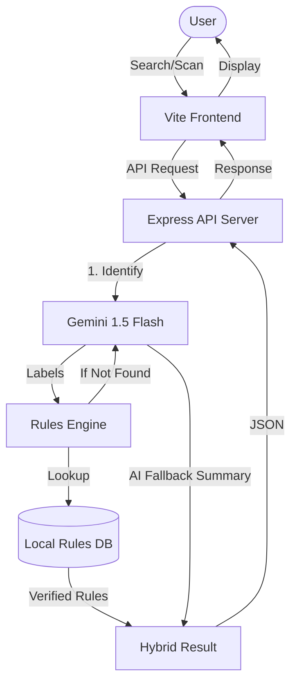

# GomiSense

GomiSense is a Japan-focused waste sorting assistant. It helps users identify how to dispose of household items based on local municipality rules. Users can select a municipality, search by item name, use voice input, or upload/take a photo. The backend returns the disposal category, preparation steps, notes, confidence score, and bilingual English/Japanese summaries.

The project is designed to use Gemini API for multimodal classification: vision, voice-derived text, and typed text. Municipality rules are kept in local TypeScript data, so the app does not need a database.

## What The Project Does

- Lets users choose a supported Japanese municipality.
- Searches common waste items with debounced suggestions.
- Classifies typed item names using Gemini plus local municipality rule guidance.
- Accepts uploaded/captured images and uses Gemini Vision for item recognition before applying municipality rules.
- Supports voice input in the browser and can pass recognized text into the same Gemini-backed classification flow.
- Supports English and Japanese UI copy.
- Shows disposal category, collection guidance, preparation steps, special notes, and confidence score.
- Provides an OpenAPI spec used to generate React Query API hooks and Zod request/response validators.

## Tech Stack

- Monorepo: pnpm workspaces
- Runtime: Node.js 24
- Language: TypeScript
- Frontend: React, Vite, Tailwind CSS, shadcn/ui-style components, Wouter, TanStack Query
- Backend: Express 5, Pino logging, CORS
- Validation: Zod generated from OpenAPI
- API code generation: Orval
- AI API: Gemini API for vision, voice/text understanding, and waste classification assistance
- Database: Not required for this MVP; municipality data lives in local code

## Project Structure

```text
.
+-- artifacts/
|   +-- api-server/              # Express API server
|   |   +-- src/
|   |   |   +-- app.ts           # Express app setup and middleware
|   |   |   +-- index.ts         # Server entry point, reads PORT
|   |   |   +-- lib/logger.ts    # Pino logger
|   |   |   +-- routes/          # API route handlers
|   |   |   +-- rules/           # Municipality data and classification engine
|   |   +-- build.mjs            # esbuild production build script
|   |   +-- package.json
|   +-- gomi-sense/              # Main React/Vite web app
|   |   +-- src/
|   |   |   +-- components/      # App components and UI primitives
|   |   |   +-- hooks/           # React hooks
|   |   |   +-- lib/             # App store and utilities
|   |   |   +-- pages/           # Route pages
|   |   |   +-- App.tsx          # App routing/providers
|   |   |   +-- main.tsx         # React entry point
|   |   +-- public/              # Static assets
|   |   +-- vite.config.ts       # Vite config, reads PORT and BASE_PATH
|   |   +-- package.json
|   +-- mockup-sandbox/          # Generated design/mockup sandbox
+-- lib/
|   +-- api-client-react/        # Generated React Query client and custom fetch
|   +-- api-spec/                # OpenAPI spec and Orval config
|   +-- api-zod/                 # Generated Zod validators for API requests
|   +-- db/                      # Legacy scaffold; not required by the MVP
+-- scripts/                     # Workspace scripts
+-- .env                         # Local environment variable reference
+-- package.json                 # Root workspace scripts
+-- pnpm-workspace.yaml          # Workspace packages and dependency catalog
+-- tsconfig*.json               # Shared TypeScript config
```

## Main API Endpoints

All backend routes are mounted under `/api`.

| Method | Endpoint | Purpose |
| --- | --- | --- |
| `GET` | `/api/healthz` | Health check |
| `GET` | `/api/municipalities` | List supported municipalities |
| `GET` | `/api/municipalities/:municipalityId` | Get one municipality profile |
| `POST` | `/api/classify-item` | Classify a typed waste item |
| `POST` | `/api/classify-image` | Classify a base64 image using Gemini Vision |
| `GET` | `/api/demo-samples` | Return demo/common sample items |
| `GET` | `/api/search-items` | Search known item rules by name |

## Environment Variables

See `.env` for the local reference values and required API keys.

Currently used by the code:

- `PORT`: Required by `artifacts/api-server/src/index.ts` and `artifacts/gomi-sense/vite.config.ts`.
- `BASE_PATH`: Required by the web app Vite config.
- `LOG_LEVEL`: Optional API logger level, defaults to `info`.
- `NODE_ENV`: Used for development/production behavior.
- `GEMINI_API_KEY`: Required for Gemini-powered vision, voice/text, and classification features.
- `GEMINI_MODEL`: Optional Gemini model override. Defaults to `gemini-2.5-flash`.

Not used:

- `DATABASE_URL`: Not needed. The project should avoid database dependencies for this MVP.
- `OPENAI_API_KEY`: Not needed. Gemini is the selected AI provider.

## Local Development

Install dependencies:

```bash
pnpm install
```

Start both the API server and the web app:

```bash
pnpm dev
```

Alternatively, run them separately:

```bash
# Start only the API server
pnpm dev:api

# Start only the web app
pnpm dev:web
```

The web app will be available at `http://localhost:20898` and the API at `http://localhost:8080`.

Interactive API documentation (Swagger) is available at `http://localhost:8080/api/docs`.

## Useful Commands

```bash
pnpm run typecheck    # Validate TypeScript across the workspace
pnpm run build        # Build the entire project
pnpm dev              # Run full-stack development environment
pnpm dev:api          # Run only the backend
pnpm dev:web          # Run only the frontend
pnpm --filter @workspace/api-spec run codegen  # Regenerate API hooks
```

## Application Architecture

GomiSense uses a **Hybrid Knowledge Engine** that combines a verified local rules database with the Gemini 1.5 Flash AI model.

### Process Flow


### Key Components
- **Vite Frontend**: A responsive React application using Tailwind CSS and Lucide icons.
- **Express API Server**: Handles classification requests and manages municipality data.
- **Rules Engine**: A sophisticated matching algorithm that prioritizes verified local rules over AI guesses.
- **Local Rules DB**: A curated database of Japanese municipality disposal rules and common items.
- **Gemini 1.5 Flash**: Used for multi-modal identification (text/images) and providing fallback instructions for unknown items.

## Supported Municipalities

- Tokyo, Shibuya Ward
- Osaka City
- Kyoto City
- Yokohama City
- Fukuoka City

The detailed categories, collection days, fallback guidance, and item rules live in `artifacts/api-server/src/rules/municipalities.ts`.

## Important Notes

- The intended production AI provider is Gemini API.
- Gemini should be used for image understanding and text classification support, while final disposal guidance should stay grounded in local municipality rules.
- The project does not require a database. Avoid adding database setup unless the product requirements change.
- The OpenAPI file in `lib/api-spec/openapi.yaml` is the source of truth for generated clients and validators.
- After regenerating API code, keep `lib/api-zod/src/index.ts` exporting only from `./generated/api` to avoid generated barrel export conflicts.
