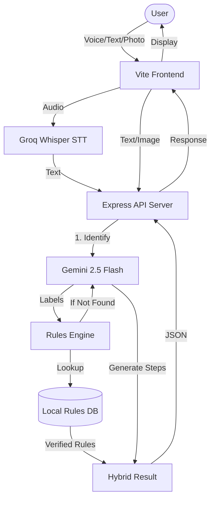

# GomiSense

GomiSense is a Japan-focused waste sorting assistant. It helps users identify how to dispose of household items based on local municipality rules. Users can select a municipality, search by item name, use voice input, or upload/take a photo. The backend returns the disposal category, preparation steps, notes, confidence score, and bilingual English/Japanese summaries.

The project is designed to use Gemini API for multimodal classification: vision, voice-derived text, and typed text. Municipality rules are kept in local TypeScript data, so the app does not need a database.

---

## 🚀 What's New (Production Update)

- **Groq Whisper Integration**: Replaced browser-based speech recognition with Groq's high-speed Whisper Large v3 model for 99% accuracy on mobile devices and noisy environments.
- **Hybrid AI Fallback**: When an item isn't in our local database, the AI now generates logical, context-aware disposal steps instead of simple summaries.
- **Direct AI Search**: Users can now type or speak directly on the Home page search bar for instant AI classification results.
- **Dedicated Camera Vision**: The "Scan" button now opens a focused Camera-Only page for easier photo capture and analysis.
- **Local-First Fallbacks**: Added a local database of 200+ common items that loads instantly, even if the backend is waking up (eliminates blank loading states).
- **Consolidated Navigation**: Removed the bottom nav and moved all controls (Search, Cities, Rules) to a fixed, sticky top header.

---

## Tech Stack

- **Monorepo**: pnpm workspaces
- **AI Models**: 
  - **Gemini 2.5 Flash**: Image recognition, text classification, and grounding.
  - **Groq Whisper-Large-v3**: High-speed, high-accuracy speech-to-text.
- **Frontend**: React, Vite, Tailwind CSS, shadcn/ui, Wouter, TanStack Query
- **Backend**: Express 5, Pino logging
- **API Communication**: OpenAPI spec with generated React Query hooks and Zod validators.

---

## Application Architecture

GomiSense uses a **Hybrid Knowledge Engine** that combines a verified local rules database with advanced LLMs.

### Process Flow

## Supported Municipalities

- Tokyo, Shibuya Ward
- Osaka City
- Kyoto City
- Yokohama City
- Fukuoka City

© 2026 GomiSense Team.
