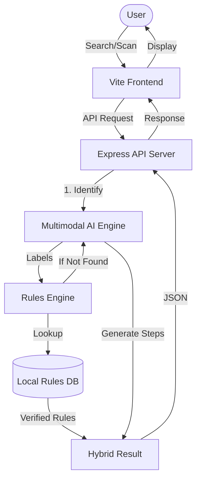

# GomiSense 🗑️✨

### Your Smart Companion for Japan's Waste Sorting.

[](https://opensource.org/licenses/MIT)

GomiSense is a smart, local-first garbage-sorting assistant designed to solve a daily frustration for residents in Japan. By combining multimodal AI with specific municipality rules, it turns a complex chore into a seamless interaction.

---

## 🧩 The Challenge: Japan's Sorting Maze

Waste sorting in Japan is famously exact, local, and often overwhelming. Rules vary significantly between wards and cities, and missing a detail can mean uncollected trash or confusion. This is particularly challenging for new residents, students, and busy families.

## 💡 The Solution: GomiSense

GomiSense provides intuitive AI-powered guidance that helps you sort waste correctly in seconds. Whether you're holding a mysterious plastic container or an old appliance, GomiSense tells you exactly where it goes.

### 🚀 Key Features

- **📸 Vision Scan**: Take a photo of any item. GomiSense identifies it and applies your local city's rules instantly.
- **🎙️ Voice Recognition**: Just say the name of the item. Perfect for when your hands are full.
- **📍 Hyper-Local Rules**: Tailored guidance for cities like **Shibuya**, **Osaka**, **Kyoto**, **Yokohama**, and **Fukuoka**.
- **🌏 Bilingual UI**: Seamlessly switch between English and Japanese instructions.
- **⚡ Hybrid Engine**: Combines a verified local rules database with high-performance AI for 100% coverage.

---

## 🛠️ How to Use GomiSense

GomiSense is open-source and easy to set up for personal use or community deployment.

### For Residents (App Users)
1.  **Choose Your City**: Select your municipality from the header to load local rules.
2.  **Identify Item**:
    - **Search**: Type the item name in the search bar.
    - **Scan**: Tap the camera icon to identify an item using AI vision.
    - **Voice**: Tap the microphone to speak the item name.
3.  **Follow Instructions**: Get clear steps on disposal categories (Burnable, Non-burnable, PET, etc.) and preparation tips (e.g., "Remove the cap and label").

### For Developers (Local Setup)

This project uses **pnpm workspaces** for a streamlined monorepo experience.

1.  **Clone the Repository**
    ```bash
    git clone https://github.com/JacobAsir/GomiSense.git
    cd GomiSense
    ```

2.  **Install Dependencies**
    ```bash
    pnpm install
    ```

3.  **Environment Configuration**
    Create a `.env` file in the root directory. You will need a **Gemini API Key** from [Google AI Studio](https://aistudio.google.com/).
    ```env
    GEMINI_API_KEY=your_api_key_here
    PORT=3001
    ```

4.  **Start Development Mode**
    ```bash
    pnpm dev
    ```
    Access the frontend at `http://localhost:5173` and the API at `http://localhost:3001`.

---

## 🏗️ Technical Architecture

GomiSense uses a **Hybrid Knowledge Engine**. It first checks a verified local database of ~200+ common items for instant results. If an item isn't found, it leverages multimodal AI to classify the item based on the municipality's general logic.

### Process Flow


## 📂 Project Structure

```text
.
+-- artifacts/
|   +-- api-server/              # Express API server
|   |   +-- src/
|   |   |   +-- app.ts           # Express app setup and middleware
|   |   |   +-- index.ts         # Server entry point, reads PORT
|   |   |   +-- lib/logger.ts    # Pino logger
|   |   |   +-- routes/          # API route handlers
|   |   |   +-- rules/           # Municipality data and classification engine
|   |   +-- build.mjs            # esbuild production build script
|   |   +-- package.json
|   +-- gomi-sense/              # Main React/Vite web app
|   |   +-- src/
|   |   |   +-- data/            # Local fallback data (for cold starts)
|   |   |   +-- components/      # App components and UI primitives
|   |   |   +-- hooks/           # React hooks
|   |   |   +-- lib/             # App store and utilities
|   |   |   +-- pages/           # Route pages
|   |   |   +-- App.tsx          # App routing/providers
|   |   |   +-- main.tsx         # React entry point
|   |   +-- public/              # Static assets (Logo, Favicon)
|   |   +-- vite.config.ts       # Vite config, reads PORT and BASE_PATH
|   |   +-- package.json
|   +-- mockup-sandbox/          # Generated design/mockup sandbox
+-- lib/
|   +-- api-client-react/        # Generated React Query client and custom fetch
|   +-- api-spec/                # OpenAPI spec and Orval config
|   +-- api-zod/                 # Generated Zod validators for API requests
+-- scripts/                     # Workspace scripts
+-- render.yaml                  # Production Deployment Blueprint
+-- .env                         # Local environment variable reference
+-- package.json                 # Root workspace scripts
+-- pnpm-workspace.yaml          # Workspace packages and dependency catalog
+-- tsconfig*.json               # Shared TypeScript config
```

## 📡 Main API Endpoints

All backend routes are mounted under `/api`.

| Method | Endpoint | Purpose |
| --- | --- | --- |
| `GET` | `/api/healthz` | Health check |
| `GET` | `/api/municipalities` | List supported municipalities |
| `GET` | `/api/municipalities/:municipalityId` | Get one municipality profile |
| `POST` | `/api/classify-item` | Classify a typed waste item |
| `POST` | `/api/classify-image` | Classify a base64 image using Gemini Vision |
| `GET` | `/api/demo-samples` | Return demo/common sample items |
| `GET` | `/api/search-items` | Search known item rules by name |

## 🔑 Environment Variables

See `.env.example` for the local reference values and required API keys.

- `GEMINI_API_KEY`: Required for AI features (Set in Render Dashboard).
- `PORT`: Required for local dev and API routing.
- `BASE_PATH`: Frontend routing base.

## ☁️ Production Deployment (Render)

GomiSense is deployed as a two-service architecture on Render:
1.  **Backend (Web Service)**: Handles AI and Rules logic.
2.  **Frontend (Static Site)**: Optimized for fast global delivery.

The configuration is managed via the `render.yaml` file in the root directory.

## 🧰 Tech Stack

- **Frontend**: React 18, Vite, Tailwind CSS, shadcn/ui, TanStack Query.
- **Backend**: Express 5 (Node.js), Pino Logger.
- **AI Integration**: Gemini 2.0 Flash (Multimodal Vision & Text).
- **Voice**: Web Speech API / Groq Whisper.
- **Tooling**: OpenAPI Spec, Orval (Type-safe API Hooks), Zod.

---

## 🏘️ Supported Municipalities (Expanding)

- Tokyo, Shibuya Ward
- Osaka City
- Kyoto City
- Yokohama City
- Fukuoka City

## 📄 License

Distributed under the MIT License. See `LICENSE` for more information.

---
*Created with ❤️ for the international community in Japan.*
