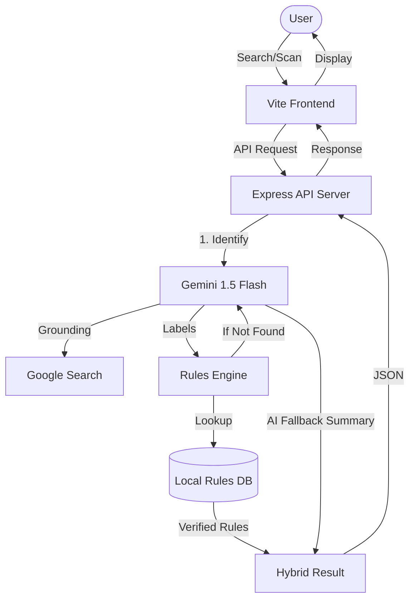

# GomiSense

GomiSense is a Japan-focused waste sorting assistant. It helps users identify how to dispose of household items based on local municipality rules. Users can select a municipality, search by item name, use voice input, or upload/take a photo. The backend returns the disposal category, preparation steps, notes, confidence score, and bilingual English/Japanese summaries.

The project is designed to use Gemini API for multimodal classification: vision, voice-derived text, and typed text. Municipality rules are kept in local TypeScript data, so the app does not need a database.

---

## 🚀 What's New (Production Update)

- **Direct AI Search**: Users can now type or speak directly on the Home page search bar for instant AI classification results.
- **Dedicated Camera Vision**: The "Scan" button now opens a focused Camera-Only page for easier photo capture and analysis.
- **Google Search Grounding**: Gemini now uses live Google Search to verify disposal rules for rare or unusual items.
- **Local-First Fallbacks**: Added a local database of 150+ common items that loads instantly, even if the backend is waking up (eliminates blank loading states).
- **Consolidated Navigation**: Removed the bottom nav and moved all controls (Search, Cities, Rules) to a fixed, sticky top header with safe-area support for mobile.
- **Visual Branding**: Integrated the GomiSense "Leaf" logo and updated the favicon for a professional look.

---

## What The Project Does

- Lets users choose a supported Japanese municipality.
- Searches common waste items with debounced suggestions.
- Classifies typed item names using Gemini plus local municipality rule guidance.
- Accepts uploaded/captured images and uses Gemini Vision for item recognition before applying municipality rules.
- Supports voice input in the browser and can pass recognized text into the same Gemini-backed classification flow.
- Supports English and Japanese UI copy.
- Shows disposal category, collection guidance, preparation steps, special notes, and confidence score.
- Provides an OpenAPI spec used to generate React Query API hooks and Zod request/response validators.

## Tech Stack

- Monorepo: pnpm workspaces
- Runtime: Node.js 24
- Language: TypeScript
- Frontend: React, Vite, Tailwind CSS, shadcn/ui-style components, Wouter, TanStack Query
- Backend: Express 5, Pino logging, CORS
- Validation: Zod generated from OpenAPI
- AI API: Gemini API for vision, voice/text understanding, and waste classification assistance
- Database: Not required for this MVP; municipality data lives in local code

## Project Structure

```text
.
+-- artifacts/
|   +-- api-server/              # Express API server
|   |   +-- src/
|   |   |   +-- app.ts           # Express app setup and middleware
|   |   |   +-- index.ts         # Server entry point, reads PORT
|   |   |   +-- lib/logger.ts    # Pino logger
|   |   |   +-- routes/          # API route handlers
|   |   |   +-- rules/           # Municipality data and classification engine
|   |   +-- build.mjs            # esbuild production build script
|   |   +-- package.json
|   +-- gomi-sense/              # Main React/Vite web app
|   |   +-- src/
|   |   |   +-- data/            # Local fallback data (for cold starts)
|   |   |   +-- components/      # App components and UI primitives
|   |   |   +-- hooks/           # React hooks
|   |   |   +-- lib/             # App store and utilities
|   |   |   +-- pages/           # Route pages
|   |   |   +-- App.tsx          # App routing/providers
|   |   |   +-- main.tsx         # React entry point
|   |   +-- public/              # Static assets (Logo, Favicon)
|   |   +-- vite.config.ts       # Vite config, reads PORT and BASE_PATH
|   |   +-- package.json
|   +-- mockup-sandbox/          # Generated design/mockup sandbox
+-- lib/
|   +-- api-client-react/        # Generated React Query client and custom fetch
|   +-- api-spec/                # OpenAPI spec and Orval config
|   +-- api-zod/                 # Generated Zod validators for API requests
+-- scripts/                     # Workspace scripts
+-- render.yaml                  # Production Deployment Blueprint
+-- .env                         # Local environment variable reference
+-- package.json                 # Root workspace scripts
+-- pnpm-workspace.yaml          # Workspace packages and dependency catalog
+-- tsconfig*.json               # Shared TypeScript config
```

## Main API Endpoints

All backend routes are mounted under `/api`.

| Method | Endpoint | Purpose |
| --- | --- | --- |
| `GET` | `/api/healthz` | Health check |
| `GET` | `/api/municipalities` | List supported municipalities |
| `GET` | `/api/municipalities/:municipalityId` | Get one municipality profile |
| `POST` | `/api/classify-item` | Classify a typed waste item |
| `POST` | `/api/classify-image` | Classify a base64 image using Gemini Vision |
| `GET` | `/api/demo-samples` | Return demo/common sample items |
| `GET` | `/api/search-items` | Search known item rules by name |

## Environment Variables

See `.env` for the local reference values and required API keys.

- `GEMINI_API_KEY`: Required for AI features (Set in Render Dashboard).
- `PORT`: Required for local dev and API routing.
- `BASE_PATH`: Frontend routing base.

## ☁️ Production Deployment (Render)

GomiSense is deployed as a two-service architecture on Render:
1.  **Backend (Web Service)**: Handles AI and Rules logic.
2.  **Frontend (Static Site)**: Optimized for fast global delivery.

The configuration is managed via the `render.yaml` file in the root directory. To deploy your own instance, simply connect your GitHub repo to Render and it will automatically detect the blueprint.

## Application Architecture

GomiSense uses a **Hybrid Knowledge Engine** that combines a verified local rules database with the Gemini 1.5 Flash AI model.

### Process Flow


## Supported Municipalities

- Tokyo, Shibuya Ward
- Osaka City
- Kyoto City
- Yokohama City
- Fukuoka City

© 2026 GomiSense Team.
